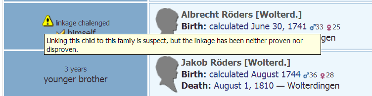

# Webtrees Custom Module: ⚶ Families

This [webtrees](https://www.webtrees.net/) custom module provides an extended 'Families' tab, with hooks for other custom modules.
The project’s website is [cissee.de](https://cissee.de).

## Contents

* [Features](#features)
* [Download](#download)
* [Installation](#installation)
* [License](#license)

### Features<a name="features"/>

Mainly intended as a base for other custom modules. One feature is available independently:

* Basic support for the GEDCOM child linkage status field (currently editable only via raw GEDCOM, this is a FAMC attribute which allows to mark family - child relations as challenged, proven or disproven):

### Download<a name="download"/>

* Current version: 1.7.9.9
* Based on and tested with webtrees 1.7.9, may also work with older 1.7.x versions.
* Requires the Hooks module ('hooks_repackaged', or the original Hooks module via webtrees-geneajaubart).
* Download the zipped module, including all required dependencies, [here](https://cissee.de/cissee.webtrees.custom.models.latest.zip).
* Support, suggestions, feature requests: <ric@richard-cissee.de>
* Issues also via <https://github.com/ric2016/relatives_with_hooks/issues>

### Installation<a name="installation"/>

* Unzip the files and copy them to the modules_v3 folder of your webtrees installation. All required modules are included in the zip file. It's safe to overwrite the respective directories if they already exist (they are bundled with other custom modules as well), as long as other custom models using these dependencies are also upgraded to their respective latest versions.
* Enable the extended 'Families' module via Control Panel -> Modules -> Module Administration -> Families.
* Enable the Hooks module via Control Panel -> Modules -> Module Administration -> Hooks. Make sure all hooks are selected (in the preferences of the Hooks module).				
* Configure the visibility of the old and the extended 'Families' tab via Control Panel -> Modules -> Tabs (they both appear as 'Families' here - usually, you'll want to use only one of them. You may just disable the old 'Families' module altogether).

### License<a name="license"/>

* **relatives_with_hooks: a webtrees custom module**
* Copyright (C) 2016 to 2018 Richard Cissée
* Derived from **webtrees** - Copyright (C) 2010 to 2016  webtrees development team.
* Derived from **webtrees-geneajaubart** - Copyright (C) 2009 to 2016  Jonathan Jaubart.

This program is free software: you can redistribute it and/or modify
it under the terms of the GNU General Public License as published by
the Free Software Foundation, either version 3 of the License, or
(at your option) any later version.

This program is distributed in the hope that it will be useful,
but WITHOUT ANY WARRANTY; without even the implied warranty of
MERCHANTABILITY or FITNESS FOR A PARTICULAR PURPOSE. See the
GNU General Public License for more details.

You should have received a copy of the GNU General Public License
along with this program. If not, see <http://www.gnu.org/licenses/>.
